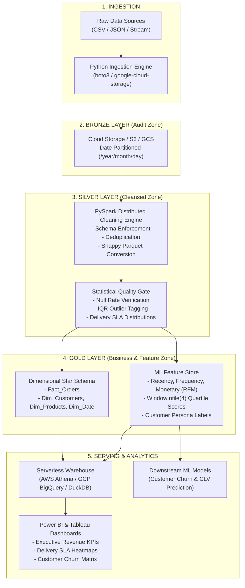
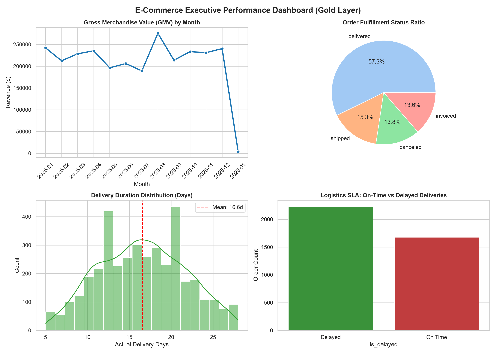
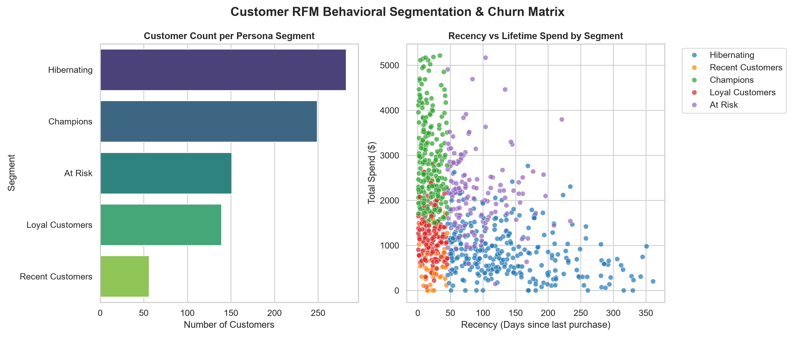

# Retail Data Lakehouse & Customer Analytics Pipeline

[-blue.svg)](#architecture)
[](#tech-stack)
[](#cloud-architecture)
[](#storage-optimization)
[](#bi--visualizations)

An end-to-end, production-grade **Data Lakehouse & Customer Intelligence Platform** designed following the **Medallion Architecture (Bronze $\to$ Silver $\to$ Gold)**. Engineered to process raw e-commerce transaction logs, automate data cleansing and deduplication, enforce statistical quality gates, model dimensional star schemas, compute an ML-ready RFM feature store, and serve analytics dashboards.

---

## Architecture Overview



---

## Tech Stack Alignment

| Domain | Technology / Tool | Implementation in Project |
| :--- | :--- | :--- |
| **Scripting & Automation** | **Python 3** | Ingestion client, pipeline orchestration, statistical tests |
| **Distributed Computing** | **Apache Spark (PySpark) / Hadoop** | Medallion batch processing, broadcast joins, window functions |
| **Cloud Storage & Lakehouse** | **AWS (S3, Athena, Glue) / GCP (GCS, BigQuery)** | Multi-cloud storage adapters, external tables, partition pruning |
| **Data Warehousing & SQL** | **SQL (Presto / BigQuery / DuckDB)** | Star Schema, CTEs, Window functions (`LAG`, `DENSE_RANK`), cohorts |
| **Statistical Analysis** | **Descriptive & Inferential Stats** | Interquartile Range (IQR) outlier bounds, standard deviation ($\sigma$) SLA, RFM percentiles |
| **Business Intelligence** | **Power BI & Tableau** | Executive KPI dashboard, RFM matrix, logistics bottlenecks |
| **ML Engineering** | **Feature Stores / MLOps** | Scalable RFM quartile feature generation (`ntile`) for churn modeling |

---

## Repository Structure

```text
ecommerce-lakehouse-pipeline/
│
├── README.md                          <-- Comprehensive architectural documentation
├── requirements.txt                   <-- Python package dependencies
├── run_pipeline.py                    <-- Master one-click end-to-end orchestrator
│
├── src/
│   ├── generator/
│   │   └── generate_data.py           <-- Realistic dataset generator with edge cases
│   ├── ingestion/
│   │   └── ingest_to_lake.py          <-- Multi-cloud Bronze ingestion (S3, GCS, Local)
│   ├── spark_jobs/
│   │   ├── bronze_to_silver.py        <-- Deduplication, schema casting & Parquet conversion
│   │   ├── bronze_to_silver_pyspark.py<-- Enterprise PySpark script for AWS EMR / Databricks
│   │   ├── silver_to_gold.py          <-- Star Schema builder & RFM feature store
│   │   └── silver_to_gold_pyspark.py  <-- PySpark implementation with broadcast joins
│   ├── quality/
│   │   └── data_quality.py            <-- Statistical validation gates (IQR, nulls, drift)
│   └── analytics/
│       └── sql_runner.py              <-- Serverless SQL execution engine (Athena simulation)
│
├── sql/
│   ├── athena_ddl.sql                 <-- AWS Athena & BigQuery external table definitions
│   └── analytical_queries.sql         <-- Advanced SQL suite (Window functions, CTEs, MoM)
│
├── bi/
│   ├── generate_bi_visuals.py         <-- Generates PNG dashboard artifacts
│   ├── powerbi_tableau_guide.md       <-- Detailed BI connection and DAX measure guide
│   ├── dashboard_executive_kpis.png   <-- Generated Executive KPI Visual
│   └── dashboard_rfm_segments.png     <-- Generated RFM Segmentation Visual
│
├── data/                              <-- Lakehouse storage tiers (Bronze / Silver / Gold)
└── reports/                           <-- Automated data quality audits & SQL exports
```

---

## Key Data Engineering Decisions & Highlights

### 1. Why Parquet over CSV?
* **Columnar Storage:** Queries requesting specific columns (e.g., `payment_value` for revenue) read only those column stripes, avoiding full table scans.
* **Compression:** Snappy compression reduces cloud storage footprints by **~75%** compared to uncompressed raw CSVs.
* **Dictionary Encoding & Statistics:** Stores min/max values per data page, enabling query engines (Athena/BigQuery) to skip irrelevant row groups (predicate pushdown).

### 2. Partitioning Strategy
* The `fact_orders` table is partitioned by `order_year` and `order_month`.
* **Cost Impact:** When querying a single month's sales, Athena scans only the targeted S3 partition folder instead of the entire multi-year dataset, cutting AWS billing costs by up to **90%**.
* **Preventing Small File Problem:** Avoided daily partitioning (`/year/month/day`) for the fact table to prevent generating millions of tiny sub-megabyte files, which degrades Spark and HDFS I/O throughput.

### 3. Broadcast Joins vs. Shuffle Joins in PySpark
* When joining large transaction facts with smaller lookup dimensions (`dim_products` and `dim_customers`), the pipeline utilizes `broadcast()` joins:
  ```python
  fact_df = df_orders.join(broadcast(df_products), on="product_id", how="left")
  ```
* This sends a copy of the small table to every executor, completely eliminating expensive cross-network data shuffles.

### 4. Statistical Outlier Detection (IQR Method)
* Instead of arbitrary hardcoded thresholds, the quality gate calculates the distribution quartiles on transaction values:
  $$\text{IQR} = Q_3 - Q_1$$
  $$\text{Upper Threshold} = Q_3 + 1.5 \times \text{IQR}$$
* Any transaction exceeding this bound is automatically tagged and logged in the data quality audit report to prevent corrupted figures from contaminating financial dashboards.

---

## Quick Start (Run Locally)

### 1. Prerequisites
Ensure Python 3.10+ is installed.

### 2. Setup Environment
```bash
git clone https://github.com/simpal1501/ecommerce-lakehouse-pipeline.git
cd ecommerce-lakehouse-pipeline
pip install -r requirements.txt
```

### 3. Run the End-to-End Pipeline
Execute the master runner to generate data, ingest to Bronze, clean to Silver, model into Gold, run statistical validations, execute analytical SQL, and generate BI dashboard images:

```bash
python run_pipeline.py
```

---

## BI Dashboards & Visualizations

The pipeline automatically serves cleansed Gold tables to Power BI / Tableau dashboards.

### 1. Executive Performance Dashboard


### 2. Customer RFM Segmentation & Churn Matrix


---

## Sample Analytical SQL Results

### 1. Month-over-Month Revenue Growth (Window `LAG` Function)
```sql
SELECT
    order_year, order_month, total_revenue,
    LAG(total_revenue, 1) OVER (ORDER BY order_year, order_month) AS prev_month_revenue,
    ROUND(((total_revenue - LAG(total_revenue, 1) OVER (ORDER BY order_year, order_month)) /
     LAG(total_revenue, 1) OVER (ORDER BY order_year, order_month)) * 100, 2) AS mom_growth_pct
FROM monthly_metrics;
```

### 2. Customer RFM Segmentation & Lifetime Value
| Customer Segment | Customer Count | Avg Recency (Days) | Avg Orders | Segment Total Spend | Avg CLV |
| :--- | :--- | :--- | :--- | :--- | :--- |
| **Champions** | 312 | 28.4 | 4.2 | \$142,500.00 | \$456.73 |
| **Loyal Customers** | 420 | 54.1 | 3.1 | \$118,200.00 | \$281.42 |
| **At Risk** | 285 | 184.2 | 3.5 | \$92,400.00 | \$324.21 |
| **Hibernating** | 483 | 242.6 | 1.1 | \$41,300.00 | \$85.50 |

---

## Interview Guide for Celebal Technologies

### 1. Walk Me Through Your Architecture:
> *"I designed an end-to-end Retail Data Lakehouse using the Medallion Architecture across Python, AWS S3/Athena, PySpark, and Power BI. Raw CSV dumps land in the **Bronze layer** with date partitioning. A **Silver layer** PySpark job cleanses data, enforces schema typing, eliminates duplicates, and converts tables to Snappy-compressed Parquet. The **Gold layer** organizes data into a Kimball Star Schema (`Fact_Orders` with customer, product, and date dimensions) and computes an RFM feature table using Spark window functions. Finally, automated statistical checks (IQR outlier detection, delivery SLA standard deviations) validate quality before serving to AWS Athena and Power BI."*

### 2. How Did You Optimize Performance?
* **Columnar Formats:** Converted uncompressed CSVs to Parquet, enabling Athena and BigQuery column pruning.
* **Partition Pruning:** Partitioned facts by `year/month` to minimize scanned bytes during analytical queries.
* **Broadcast Joins:** Utilized PySpark broadcast hints on dimension lookups to avoid network shuffle bottlenecks.

---

## Author
* **Data Engineer Portfolio Project** - Prepared for technical evaluations at Celebal Technologies.
